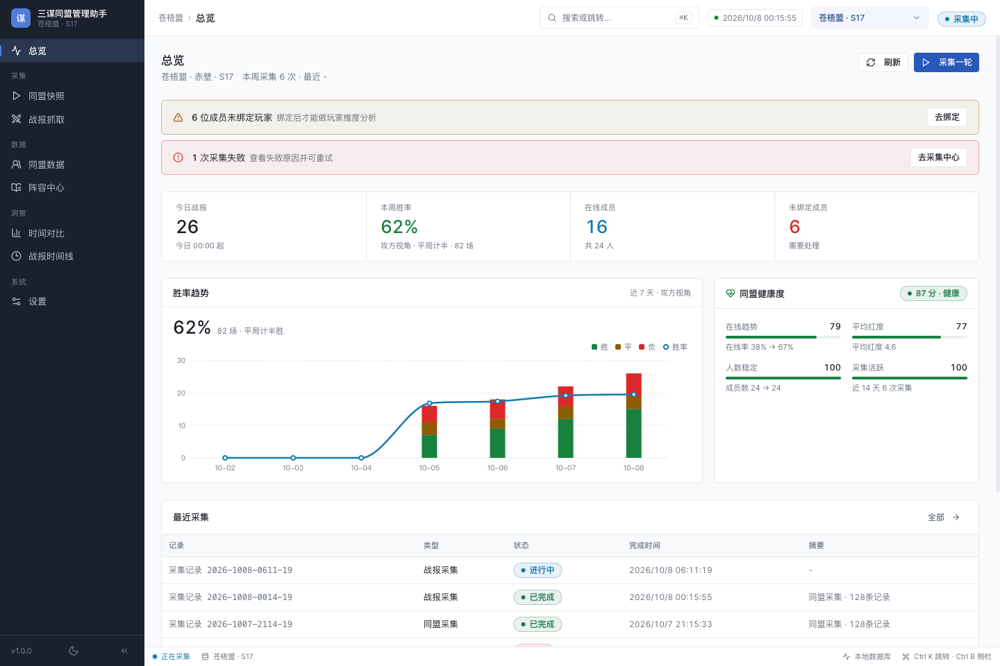
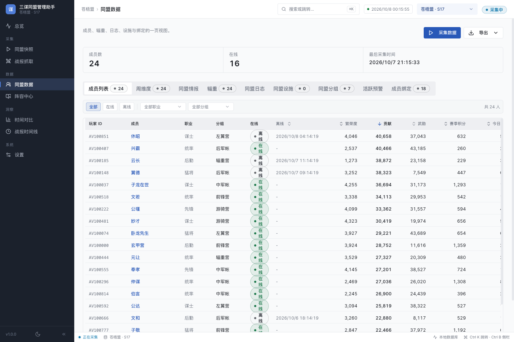
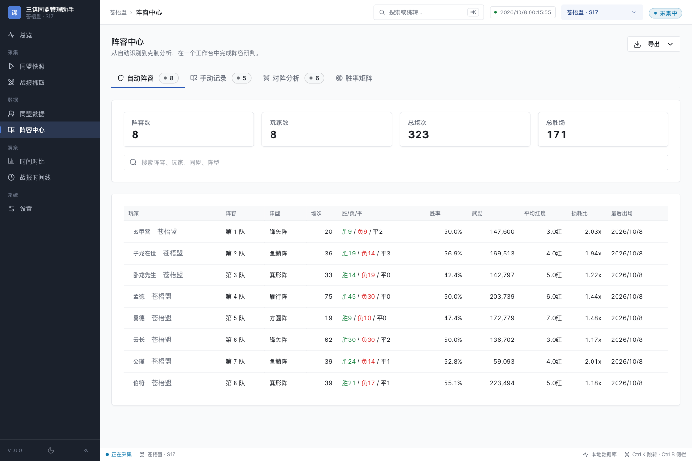
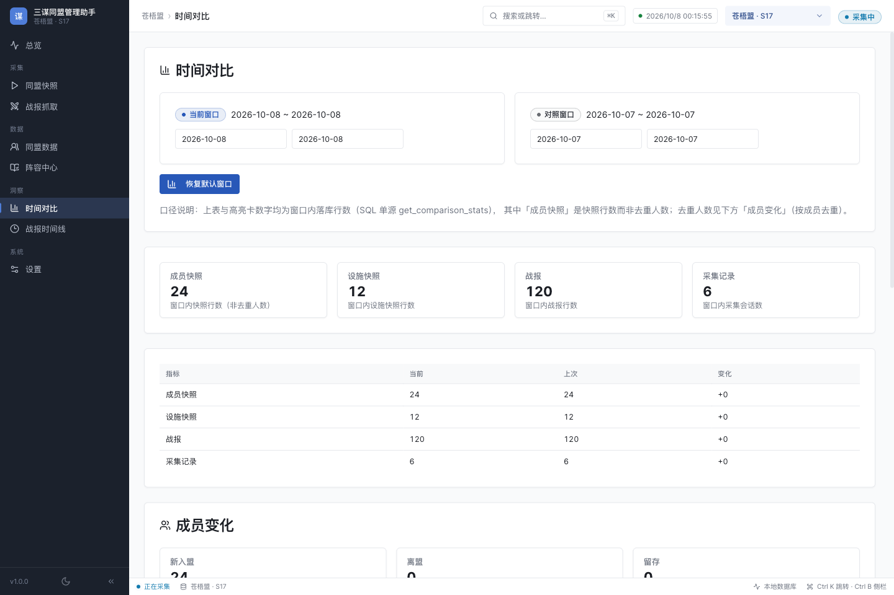

# 三谋同盟管理助手

给《三国：谋定天下》同盟管理者和玩家使用的 Windows 桌面工具。把成员、设施、辎重和战报整理到本机，方便查看同盟情况、比较历史变化、分析阵容表现和导出表格。

**已适配最新问鼎赛季《二士争功》数据。项目永久开源免费。**

[](#下载安装)
[](LICENSE)

**[下载 Windows 安装包](https://github.com/damiaozhang/sanmou-alliance-manager/releases/latest) · [玩家使用指南](docs/USER_GUIDE.md) · [反馈问题](https://github.com/damiaozhang/sanmou-alliance-manager/issues)**

## 下载安装

1. 打开[下载页面](https://github.com/damiaozhang/sanmou-alliance-manager/releases/latest)，找到页面下方的 **Assets（下载文件）**。
2. 下载后缀为 **`.exe`** 的安装包，双击安装。不要下载 `Source code`，那是给开发者使用的源码。
3. 先启动游戏，再打开助手，按下方「第一次使用」开始记录。

目前提供 **Windows 10 / 11（64 位）** 安装包。普通玩家不需要自己安装 Node.js、Rust、Python 或 Frida；安装包已包含战报采集所需的桥接运行时。

现有 v1.0.0 安装包文件名是 `Sanmou.Ledger_1.0.0_x64-setup.exe`，这是本助手的安装包。`.exe.sig` 和 `latest.json` 是更新校验文件，玩家不需要单独打开。

安装包目前未做 Windows 发布者代码签名，系统可能提示未知发布者。请核对下载来源；更新校验签名与 Windows 发布者签名是两回事。

## 界面预览（AI生成示意非成品状态）

以下是当前源码的浏览器预览截图，使用项目预置的**虚构演示数据**，用于展示界面布局；不代表真实玩家、同盟或战报记录。安装版界面以实际下载版本为准。

**总览：集中查看同盟状态、采集记录与战报趋势。**



<details>
<summary>查看同盟数据：成员、贡献、武勋与活跃情况</summary>



</details>

<details>
<summary>查看阵容中心：出场、胜负、红度与损耗比</summary>



</details>

<details>
<summary>查看时间对比：选择两个时间窗口，比较记录与成员变化</summary>



</details>

## 能帮你做什么

| 想解决的问题 | 助手里的功能 |
| --- | --- |
| 同盟成员信息散、每次都要手抄 | 记录成员、设施、日志、辎重和成员身份绑定，查看活跃度 |
| 想知道几天前后有哪些变化 | 保存历史快照，在「时间对比」中比较两个时间段 |
| 战报太多，难以集中整理 | 在本机监听并保存普通战报和同盟战报 |
| 想看哪套阵容表现好、对什么队伍占优 | 查看阵容出场、胜率、对阵结果和不同红度下的表现 |
| 想把结果发给管理组继续整理 | 导出 JSON、CSV、HTML 或 Excel（XLSX） |

统计反映的是已采集的样本，胜率不等于对所有对手的必胜概率。计算方法见[统计口径](docs/STATISTICS.md)。

## 第一次使用

**创建工作区 → 采集同盟 / 战报 → 查看统计 → 导出分享**

1. 在「总览」创建数据工作区，按区服、赛季或同盟区分数据。
2. 打开「同盟快照」，点击「采集同盟数据」，在游戏中打开或刷新相关同盟界面。单次采集完成后会自动停止。
3. 在「同盟数据」查看已采集的信息；要整理战报，进入「战报抓取」连接游戏进程。
4. 在游戏里手动打开战报、翻页或展开连战记录，助手才会收到相应数据。
5. 用「阵容中心」「时间对比」「战报时间线」查看结果，需要时导出文件。

详细操作、数据工作区与采集输出目录的区别、连接失败的排查方法见[玩家使用指南](docs/USER_GUIDE.md)。

## 常见问题

**需要付费、注册账号或购买激活码吗？**

不需要。项目永久开源免费，助手没有账号系统。

**手机或 Mac 能用吗？**

目前提供的是 Windows 10 / 11（64 位）桌面安装包。手机和 Mac 不适用这个 `.exe` 安装包。

**看不到游戏进程或连接失败怎么办？**

确认游戏已启动，刷新进程列表；仍失败时关闭助手，以管理员身份重新运行，再查看「设置」里的诊断信息。

**连接成功，为什么没有战报？**

需要在游戏中手动打开战报详情、翻页或展开连战记录，助手才能收到相应数据。也请确认选中了正确的游戏进程。

**表格在 Excel / WPS 中乱码怎么办？**

按 UTF-8 编码导入 CSV；需要直接打开表格时，可在提供该选项的页面选择 Excel（XLSX）格式。

**怎样更新，数据怎么保留？**

新版安装包发布后，可从[下载页面](https://github.com/damiaozhang/sanmou-alliance-manager/releases/latest)获取。更新前先在「设置」中备份数据；备份和导出文件也请妥善保管。

仍有问题可查看[完整使用指南](docs/USER_GUIDE.md)，或[反馈问题](https://github.com/damiaozhang/sanmou-alliance-manager/issues)。反馈时附上 Windows 版本、助手版本、操作步骤与脱敏后的错误信息，便于排查。

## 更新记录

- **v1.0.0**：首个公开版本，提供同盟数据采集、战报整理、阵容分析、时间对比与导出。
- **当前源码更新（待新版安装包发布）**：完善中文介绍与界面名称，清理仓库中的隐私样本，补充玩家指南与界面截图。

源码与说明更新后，已下载的 `.exe` 不会随之改变。已发布版本与安装文件请以[发布页面](https://github.com/damiaozhang/sanmou-alliance-manager/releases)为准。

## 数据与隐私

- 同盟数据、战报、日志和数据库保存在本机，没有账号系统、云端同步或数据分析上报。
- 版本更新功能使用本仓库的 GitHub Releases；「本地保存」不表示更新下载也不需要网络。
- 你主动导出的表格、战报、截图、日志和备份可能包含玩家名、同盟名、坐标和本机路径。分享或提交问题前请先脱敏。
- 首页截图使用虚构演示数据。请勿把自己的完整数据库或原始采集包上传到公开仓库。

## 开发与贡献

以下内容面向开发者。项目使用 Tauri 2、React 18、TypeScript、Rust 和 SQLite。

[](https://github.com/damiaozhang/sanmou-alliance-manager/actions/workflows/ci.yml)

在 Windows 开发环境中：

```powershell
npm ci
python -m pip install pyinstaller frida
npm run bridge:build
npm run tauri dev
```

首次编译 Rust 前必须构建 `frida_bridge.exe`，它不随源码入库。仅查看浏览器预览可运行 `npm run dev`，其中展示的是模拟数据，不能连接游戏。

请勿提交个人数据库、采集目录、密钥或环境配置。`.gitignore` 只能防止符合规则的未跟踪文件被默认加入，不能删除已提交的内容或历史记录。

| 文档 | 用途 |
| --- | --- |
| [开发环境](docs/DEV_SETUP.md) | 安装依赖、构建、运行与环境变量 |
| [系统架构](docs/ARCHITECTURE.md) | 模块、数据流与接口 |
| [采集协议](docs/COLLECTOR_PROTOCOL.md) | 采集进程的输入输出约定 |
| [统计口径](docs/STATISTICS.md) | 胜率、阵容与样本过滤规则 |
| [发布流程](docs/RELEASE.md) | 版本、打包、签名与更新清单 |
| [贡献指南](CONTRIBUTING.md) | 测试要求、代码约定与问题反馈 |

`src-tauri/assets/legacy/` 是当前桥接运行时仍需要的兼容源码；`docs/battle-grabber-v6/` 是集成前的历史资料，当前玩家操作以本页和使用指南为准。

## 项目说明与许可

这是社区项目，与游戏开发方、发行方没有隶属或合作关系。游戏名称与相关术语归其权利人所有。使用时请遵守游戏规则及服务条款。

代码采用 [MIT 许可](LICENSE)。第三方组件说明见 [THIRD_PARTY_NOTICES.md](THIRD_PARTY_NOTICES.md)。
